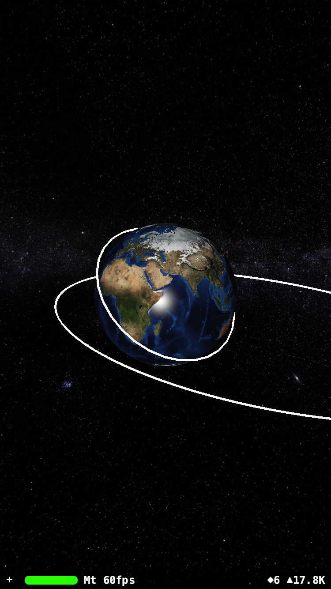

# Earth and Orbit

Earth and Orbit (working title: sattracker) is an ios swift project for visualising the earth and stuff that's orbiting it.



## Orbit
The Orbit class creates a 3D "line" for visualising an orbit path using perigee, apogee and the inclination of the orbit.

```swift
// Draw ISS orbit
let orbitNode = Orbit(apogee: 410, perigee: 408, inclination: 51)
parentNode.addChildNode(orbitNode)
```

## Pods

Two pods are used for this project
```bash
  pod 'Euclid', '~> 0.1'
  pod 'SCNLine', '~> 1.0'
```

## License
[MIT](https://choosealicense.com/licenses/mit/)
